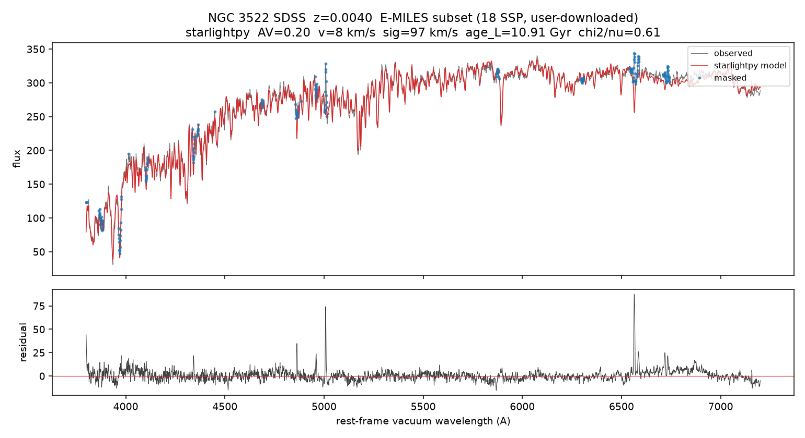

# starlightpy

用恒星种群模板的**非负**线性组合，加上尘埃消光和视向速度 / 速度弥散，拟合星系的**光学连续谱**。

这是给使用者看的页面。算法风格对齐 [Cid Fernandes et al. (2005)](https://ui.adsabs.harvard.edu/abs/2005MNRAS.358..363C) 的 STARLIGHT，**不是** Fortran `starlight.exe` 的官方发行版，也不是 1:1 克隆。

附带薄封装 [`easyppxf`](#easyppxf把线性波长交给-ppxf)：把线性采样的光谱交给 pPXF。拟合请引用 Cappellari，不要把这个包装成一种新方法。

| | |
| --- | --- |
| 版本 | 1.0.0 |
| 许可 | MIT |
| 需要你自备 | 观测谱 **和** 恒星模板（SSP）。仓库不捆绑 BC03 / E-MILES |
| 不搜索 | 宇宙学红移；发射线请 mask，不要放进同一个 `fit()` |

开发合同、阶段勾选、禁止项在 [docs/PLAN.md](docs/PLAN.md)。开发时的工作抄写页在 [docs/DEVELOP.md](docs/DEVELOP.md)。

---

## 目录

- [安装](#安装)
- [五分钟：合成谱（不需要自备模板）](#五分钟合成谱不需要自备模板)
- [拟合真星系之前](#拟合真星系之前)
- [示例：NGC 3522 + E-MILES](#示例ngc-3522--e-miles)
- [从文件读入](#从文件读入)
- [FitResult 里有什么](#fitresult-里有什么)
- [可选开关（默认关）](#可选开关默认关)
- [easyppxf](#easyppxf把线性波长交给-ppxf)
- [不要用它做什么](#不要用它做什么)
- [引用](#引用)
- [开发者](#开发者)

---

## 安装

尚未上 PyPI。从 GitHub 安装：

```bash
pip install "starlightpy[fits] @ git+https://github.com/Babapei/starlightpy.git"
```

| extra | 何时需要 |
| --- | --- |
| （无） | 只要数组进、`fit_spectrum` 出：NumPy + SciPy |
| `[fits]` | `load_sdss_fits`（astropy） |
| `[dust]` | `law="dust:F99"` 等，对接 `dust_extinction` |
| `[ppxf]` | 使用 `easyppxf` |
| `[dev]` | pytest + 上面三项，给开发者 |

克隆仓库开发：

```bash
pip install -e ".[dev]"
pytest
```

---

## 五分钟：合成谱（不需要自备模板）

`default_absorption_bases` 只是带几条吸收线的假模板，用来确认安装和 API，**不是**恒星种群库。下面这一段可以整段复制运行。

```python
import numpy as np
from starlightpy import (
    FitConfig,
    apply_mask,
    default_absorption_bases,
    fit_spectrum,
    load_fit_result,
    mock_observation,
    optical_emission_mask_regions,
    save_fit_result,
)

wave = np.arange(3800.0, 5601.0, 2.0)
bases = default_absorption_bases(wave)
flux, error = mock_observation(
    wave, bases, [0.50, 0.35, 0.15], 0.30, 80.0, 130.0,
    config=FitConfig(search_kinematics=False),
    snr=40.0,
)
config = FitConfig(
    search_kinematics=True,
    refine_kinematics=True,
    a_v_bounds=(0.0, 0.6),
    a_v_step=0.1,
    v_bounds=(50.0, 125.0),
    v_step=25.0,
    sigma_bounds=(100.0, 175.0),
    sigma_step=25.0,
)
good = apply_mask(wave, optical_emission_mask_regions())
result = fit_spectrum(wave, flux, error, bases, mask=good, config=config)
print(result.a_v, result.v0_kms, result.sigma_kms, result.x_fraction)

save_fit_result("fit.npz", result)     # 或 .json；不是 Fortran .out
loaded = load_fit_result("fit.npz")
# 读回后可画观测 vs 模型：loaded.wavelength, loaded.flux, loaded.model
```

有模板的 \(M/L\) 和年龄才做后处理，没有就不要编：

```python
from starlightpy import light_to_mass, light_weighted_age

mass, mu = light_to_mass(result.x_fraction, mass_to_light)
age_L = light_weighted_age(result.x_fraction, ages)
```

默认 `FitConfig` 的 \(A_V \times v \times \sigma\) 网格比较大。上面例子用了缩小网格，几秒内能跑完。没有误差谱时才设 `estimate_error=True`（会警告那不是真 χ²）。

---

## 拟合真星系之前

观测和模板都要先准备好。`fit_spectrum` **不**搜索宇宙学红移，**不**拟合发射线。\(x_j\) 始终是 NNLS。

1. **静止系。** 已知 \(z\) 用 `to_rest_frame`，或按下面约定使用 `redshift=`。不要让库去搜 \(z\)。
2. **同一套波长。** 静止系真空 Å；不同网格用 `resample_to`。`build_model` 不负责插值。
3. **分辨率。** `fwhm_data` / `fwhm_template` 单位 Å。只把更锐的模板抹到数据，不能反向锐化。
4. **发射线 mask。** `optical_emission_mask_regions` + `apply_mask`。不要靠 `clip_nsigma` 当发射线处理。
5. **简并。** 几十个 SSP 收不回「真实 \(x_j\)」。光加权年龄 / Z 和 \(\mu_j\) 必须自带年龄、Z、\(M/L\)。

更不易错的路径：先 `to_rest_frame` + `resample_to`，拟合时 `redshift=0`。

`FitConfig.redshift=` 只在这种约定下使用：`wave` / `bases` **已经是**静止系真空网格，`flux` 仍是观测系 \(F_\lambda\)、只是已经采样到这些波长数字上。不要把 SDSS 的 \(\lambda_\mathrm{obs}\) 既拿去建模板、又设 `redshift=z`。

光学 mask 含 Hβ / Hα 等，年老星族的吸收线也会被挡住，需要可改表。`clip_nsigma` 是拟合后的离群点；模型很差时会误删大量像素。

MILES / E-MILES 的波长一般是**空气** Å，SDSS 是**真空**。把模板轴用 `air_to_vacuum` 转过去，再和 SDSS 静止系真空网格对齐。

---

## 示例：NGC 3522 + E-MILES

下面是用**用户自己下载**的 E-MILES 子集（18 个 SSP）拟合公开 SDSS 谱 NGC 3522（\(z=0.004\)）的结果。用来展示工作流走得通：连续谱、mask、尘埃、运动学。

**这不是该星系的标准种群解**，也不是单元测试真理。换一套 SSP、窗口或网格，年龄和 \(x_j\) 都会变。



一次运行（缩小网格、18 个模板、光学 3800–7200 Å）大约得到 \(A_V \approx 0.20\)、剩余 \(v \approx 8\,\mathrm{km\,s^{-1}}\)、\(\sigma \approx 97\,\mathrm{km\,s^{-1}}\)、光加权年龄约 11 Gyr。同一套数组交给 pPXF（`easyppxf`）得到 \(\sigma \approx 109\,\mathrm{km\,s^{-1}}\)。两边运动学一个量级；pPXF 还加了多项式连续谱，数字不必相同。

复现（会下载 E-MILES npz 和 SDSS lite FITS，不写入本库）：

```bash
pip install "starlightpy[fits] @ git+https://github.com/Babapei/starlightpy.git"
pip install matplotlib
python examples/fit_ngc3522_emiles.py
```

模板来自 Cappellari 提供的 pPXF 示例文件（[Vazdekis et al. 2016](https://ui.adsabs.harvard.edu/abs/2016MNRAS.463.3409V) E-MILES）。光谱来自 SDSS。请在论文里引用这些数据，而不是只引用本仓库。

---

## 从文件读入

`load_sdss_fits` 只返回波长、流量、误差、像素 mask，**不返回宇宙学 \(z\)**（SDSS 在 SPECOBJ 等元数据里）。`.cxt` 用 `load_spectrum`。

```python
from astropy.io import fits
from starlightpy import (
    FitConfig,
    apply_mask,
    fit_spectrum,
    load_sdss_fits,
    load_spectrum,
    optical_emission_mask_regions,
    resample_to,
    to_rest_frame,
)

# wave, flux, error, flags = load_spectrum("galaxy.cxt")
wave_obs, flux_obs, err_obs, good_obs = load_sdss_fits("spec.fits")
with fits.open("spec.fits") as hdul:
    z = float(hdul["SPECOBJ"].data["z"].item())

wave_rest, flux_rest, err_rest = to_rest_frame(wave_obs, flux_obs, z, err_obs)
flux = resample_to(wave_rest, flux_rest, wave)   # wave 与 bases 同一静止系真空网格
error = resample_to(wave_rest, err_rest, wave)
good = resample_to(wave_rest, good_obs.astype(float), wave) > 0.5
good &= apply_mask(wave, optical_emission_mask_regions())
result = fit_spectrum(wave, flux, error, bases, mask=good, config=FitConfig(redshift=0.0))
```

SDSS FITS 需要 `pip install "starlightpy[fits]"`。

---

## FitResult 里有什么

`fit_spectrum` 返回 `FitResult`（字段只增不删）。流量类字段与传入观测同一单位，不是除过 `obs_scale` 的内部数组。

| 字段 | 含义 |
| --- | --- |
| `x`, `x_fraction` | NNLS 权重；归一化成光分数 |
| `a_v`, `a_yv` | \(A_V\)；可选年轻额外 \(A_{YV}\) |
| `v0_kms`, `sigma_kms` | 剩余视向速度、速度弥散（km/s） |
| `wavelength`, `flux`, `model`, `error` | 拟合网格上的 λ、观测、模型、进入 χ² 的误差 |
| `good`, `n_good`, `n_clipped`, `dropped` | 最终像素 mask、clip 个数、EX0 丢掉的成分 |
| `chi2`, `chi2_reduced` | χ² 与约化 χ² |
| `obs_scale`, `config` | 归一尺度、所用配置副本 |
| `errors` | 仅当 `error_method` 打开：粗 1σ，不是协方差 |

```python
from starlightpy import save_fit_result, load_fit_result
save_fit_result("fit.npz", result)
loaded = load_fit_result("fit.npz")
# loaded.wavelength, loaded.flux, loaded.model
```

旧存盘缺 `wavelength` / `error` / `flux` 时加载为 `None`。

---

## 可选开关（默认关）

打开前请看 [docs/PLAN.md](docs/PLAN.md)。默认：`regularize_x=None`、`error_method=None`、`pad_losvd=False`、`fit_ayv=False`、`law="CCM"`。

```python
config.regularize_x = "age_bins"       # 或 "smooth_age"；需要 template_ages=
config.error_method = "chi2_slice"     # 或 "repeat"；粗误差，不是协方差
config.pad_losvd = True                # 谱端 LOSVD 垫边；默认仍关
config.fit_ayv = True                  # 年轻模板额外 A_YV；需要 young_flags=
config.law = "dust:F99"                # 需 pip install "starlightpy[dust]"
```

`pad_losvd` 默认仍是 `False`（谱两端默认不可信）。消光可选 `.[dust]`，SDSS FITS 用 `.[fits]`。

---

## easyppxf：把线性波长交给 pPXF

两个包并排，没有 `backend=`。主业永远是 `from starlightpy import fit_spectrum`。

```python
from easyppxf import fit_spectrum as fit_ppxf

pp = fit_ppxf(wave, flux, templates, template_wave, error=err)
print(pp.velocity, pp.sigma, pp.cite)
```

需要 `pip install "starlightpy[ppxf]"`。模板波长必须比星系谱更宽（pPXF 默认速度边界约 ±2900 km/s）；同一网格时包装器会丢掉两端不够的像素，太短则报错。`easyppxf.load_sdss_fits` 只读一维谱。

---

## 不要用它做什么

- 对 \(x_j\) 做 Metropolis / 退火（固定 \(A_V,v,\sigma\) 后应是 NNLS）
- 在库里搜索宇宙学红移（与 \(v_\star\) 共线）
- 同一个 `fit()` 里拟合发射线
- 指望和 `starlight.exe` 的 `.out` 逐字节相同
- 把 pPXF / FIREFLY / Bagpipes 接进同一个 `fit_spectrum(..., backend=...)`
- 把本包装成一种新的科学方法（请引用原论文）

---

## 引用

使用 `starlightpy` 拟合时请引用算法出处，而不是把本仓库写成 STARLIGHT 官方实现：

- Cid Fernandes, R., Mateus, A., Sodré, L., Stasińska, G., & Gomes, J. M. 2005, MNRAS, 358, 363

使用 `easyppxf` / pPXF 时请引用 Cappellari（见 `FitResult.cite`）。使用 E-MILES 模板时请引用 Vazdekis et al. (2016)。使用 `dust_extinction` 时请引用对应消光曲线。SDSS 光谱请引用 SDSS。

本库是 MIT 许可的软件。

---

## 开发者

| 文档 | 谁看 |
| --- | --- |
| [docs/PLAN.md](docs/PLAN.md) | 合同：目标、禁止项、阶段 |
| [docs/PROGRESS.md](docs/PROGRESS.md) | 当前断点 |
| [docs/DEVELOP.md](docs/DEVELOP.md) | 开发工作 README（阶段用语、内部抄写） |

```bash
pip install -e ".[dev]"
pytest
```
